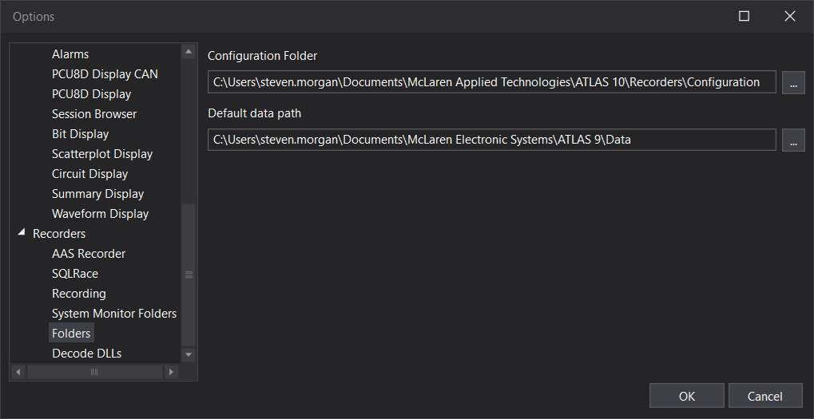
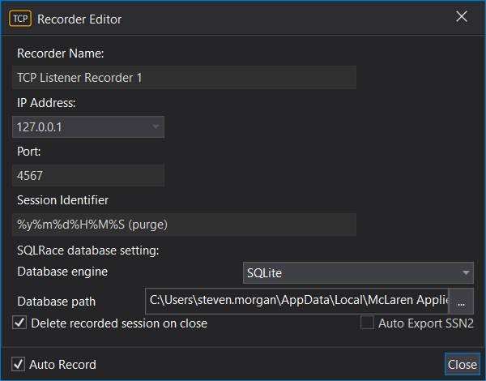
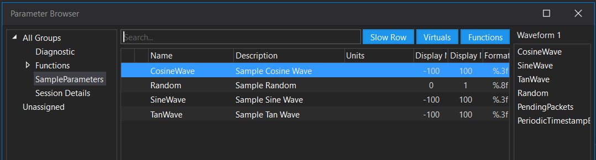
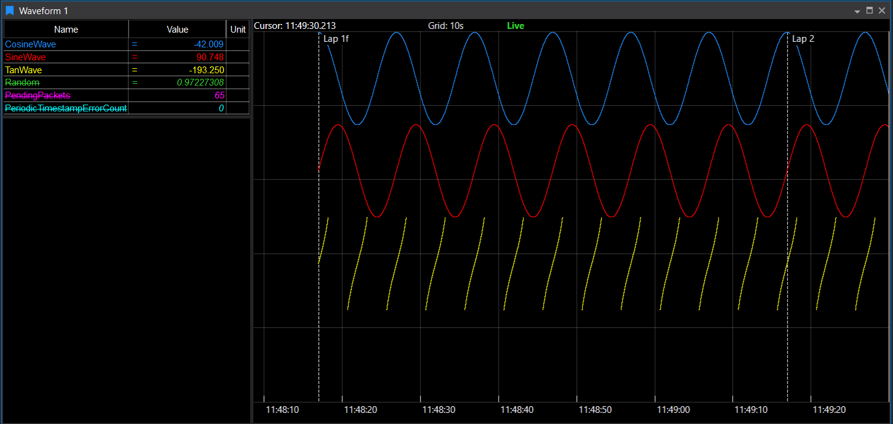

# TCP Listener Recorder Sample

Sample that demonstrates how to send live data to ATLAS via the TCP Listener Recorder.

The TCP listener recorder is ideal for:
- Data rates < 100Hz
- Parameters < 1000
- Supports periodic data and laps only
- No support for events, errors etc.
- You must send data at least once every few seconds, otherwise it stops recording automatically
- There is no end recording message type, just dispose the client instance

## TCPRecorder.Client project

Client library used to connect, configure and send lap/parameter data to ATLAS TCP Listener recorder.

### PacketConfiguration class

Used to create the configuration file needed by ATLAS to interpret the data packet into parameter values.

Pass the following to PacketConfiguration.GenerateConfiguration:
- Configuration Identifier and Version
    - Note: whenever the configuration is changed, the version number must be increased.
- Application group name
    - i.e. parameters will be identified by ParameterName:ApplicationName
- Frequency of the data in Hertz
- List of parameters

The result of calling PacketConfiguration.GenerateConfiguration:
- A configuration JSON file
- A modified configuration identified
    - This must be sent to ATLAS
- The expected data packet size is returned
    - Useful to allocate a byte buffer for the data packet

The configuration file must be stored in a location known to ATLAS (specified in Tools->Options->Recorders->Folder).

### Client class

Used to interact with the TCP Listener Recorder:
- Connect to ATLAS with a TCP Listener Recorder instance configured on a specific ip address and port
    - The ip address is generally always 'local host' (127.0.0.1)
    - Call Dispose() (or via a 'using' statement) to close the connection
- Send the configuration identifier (returned from PacketConfiguration.GenerateConfiguration)
    - Send this first and once
- Send lap notifications as appropriate
- Send data at the configured frequency (packed as configured, with no padding)
    - You don't have to send the data packets at the same frequency, however the packet timestamps must be sequential with an interval of 1/Frequency seconds
    - Holes are allowed in the data and may be sent out of order, however best avoided if at all possible

## Sample project

Demonstrates connection, setup of parameter configuration, sending lap/parameter data.

Ensure the configuration folder is set appropriately:

Then configure a TCP Listener Recorder instance in ATLAS (local machine with port number 4567 for the sample):

Run ‘Sample.exe’, then add parameters to a waveform:

With the expected result:

Press any key or close sample.exe to stop recording.